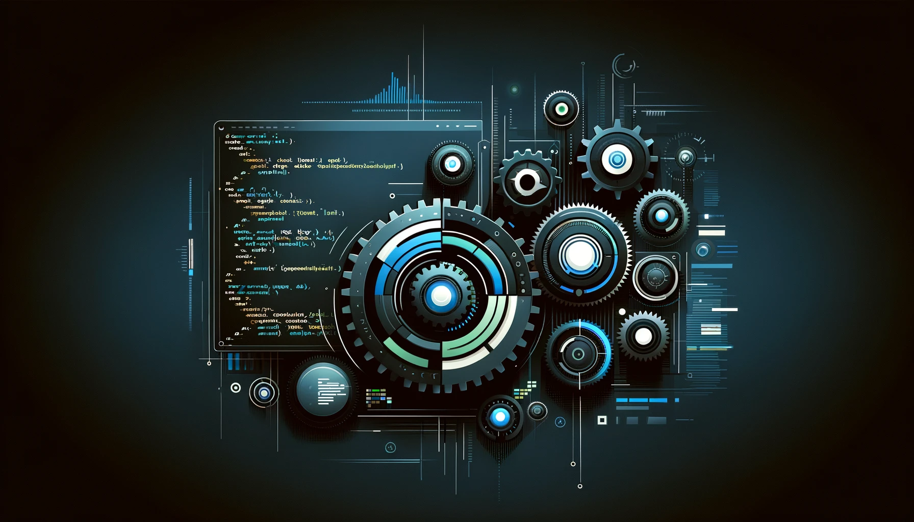

# Godot Jam 1

Starting point for a game jam with the **Godot Engine**.

 

**Getting Started**
1. Download this repo (*.zip or *.git)
1. Download the [Godot Engine](https://godotengine.org/)
1. Open the Godot Engine Editor
1. **Import** the `Godot` folder from this repo
1. Enjoy!

 

---

 

### Credits

**Creator**

- Samuel Asher Rivello 
- Over 25 years XP with game development (2024)
- Over 11 years XP with Unity (2024)

**Contact**

- Twitter - <a href="https://twitter.com/srivello/">@srivello</a>
- Git - <a href="https://github.com/SamuelAsherRivello/">Github.com/SamuelAsherRivello</a>
- Resume & Portfolio - <a href="http://www.SamuelAsherRivello.com">SamuelAsherRivello.com</a>
- LinkedIn - <a href="https://Linkedin.com/in/SamuelAsherRivello">Linkedin.com/in/SamuelAsherRivello</a> <--- Say Hello! :)

**License**

* Provided as-is under MIT License 
* Copyright © 2024 Rivello Multimedia Consulting, LLC
